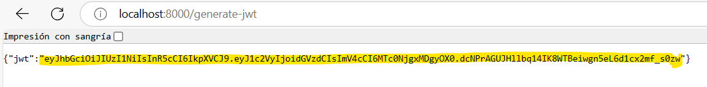
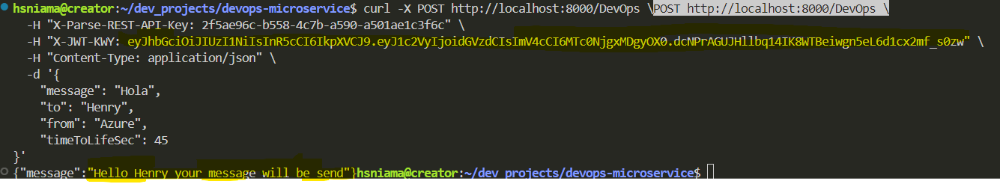
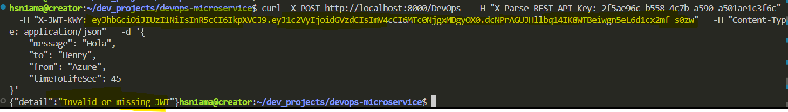
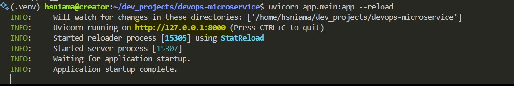
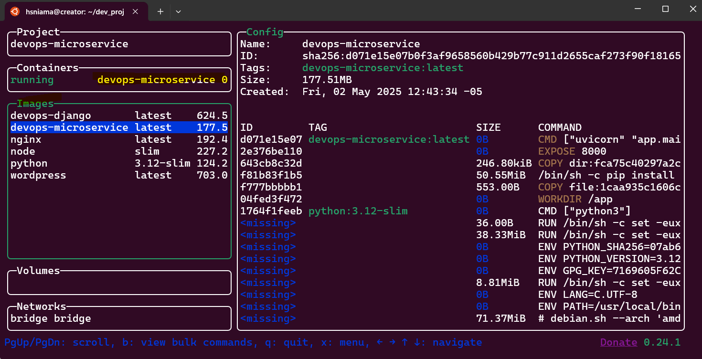
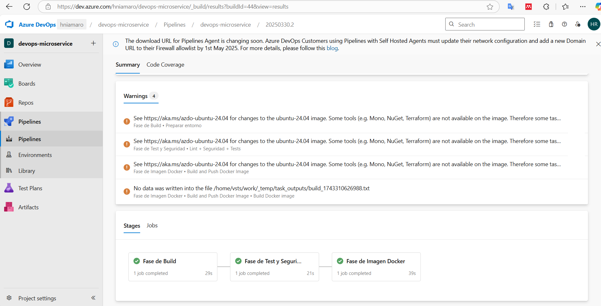

# DevOps Microservice con FastAPI y Azure AKS

Este microservicio implementado con **FastAPI** permite enviar un mensaje personalizado mediante un endpoint protegido por autenticación JWT y API Key. 

Este Microservicio se puede correr de manera local, con docker y también en un clúster de **Azure Kubernetes Service (AKS)**. Este último aplica solo si tienes una sucripción en Azure Cloud.

---

## Características

- Autenticación por **API Key** y **JWT**.
- Endpoint GET para **generar un JWT válido por 7 días**.
- Endpoint POST **/DevOps** para enviar mensajes personalizados.
- Dockerizado y desplegado en **Azure AKS**.
- Pipeline CI/CD con **Azure Pipelines**.

---

## Estructura del Proyecto

```
├── app/
│   ├── main.py               # Archivo principal con rutas y lógica del microservicio
│   └── utils/
│       ├── jwt_handler.py    # Funciones para crear y verificar JWT
│       └── __init__.py       # Inicialización de utilidades
├── tests/                    # Pruebas automatizadas con pytest
├── Dockerfile                # Imagen del contenedor
├── azure-pipelines.yml       # Pipeline CI/CD en Azure DevOps
├── k8s/
│   ├── deployment.yaml       # Configuración del deployment AKS
│   └── service.yaml          # Configuración del servicio con LoadBalancer
├── .env                      # Variables de entorno locales (ignorado en Docker)
└── README.md
```

---

## Requisitos

- Python 3.12+
- Docker
- Azure CLI (Opcional)
- Azure Pipelines (Opcional)
- Cuenta de Azure con acceso a AKS y ACR (Opcional)

---

## Endpoints disponibles

Este proyecto tiene dos enpoints:

### `GET /generate-jwt`

Este endpoint genera un JWT que sirve para ejecutar 1 sola transacción (con el POST).

**Una ves tengas el proyecto listo** (Siguiente sección), copia y pega en tu navegador la siguiente URL para generar el Token: [http://localhost:8000/generate-jwt](http://localhost:8000/generate-jwt) o pega el siguiente comando en una terminal:

```bash
curl -X GET http://localhost:8000/generate-jwt
```

Esto genera un JWT único y válido por 7 días para usarse.

**Respuesta**:
```json
{
  "jwt": "<TOKEN_AQUI>"
}
```



### `POST /DevOps`

Este método envia mensaje de prueba con el JWT generado anteriormente.

Para usarlo, abre una terminal, ubica el JWT generado en "X-JWT-KWY" y ejecuta lo siguiente:

```bash
curl -X POST \
  -H "X-Parse-REST-API-Key: 2f5ae96c-b558-4c7b-a590-a501ae1c3f6c" \
  -H "X-JWT-KWY: (AQUI VA EL JWT GENERADO POR EL PRIMER ENDPOINT GET, COPIA Y PEGA AQUI SIN LOS PARENTESIS. NO BORRES LA COMILLA DOBLE)" \
  -H "Content-Type: application/json" \
  -d '{
    "message": "Hola",
    "to": "Henry",
    "from": "Azure",
    "timeToLifeSec": 45
}' \
http://localhost:8000/DevOps
```
**NOTA:** Debes pegar el JWT generado en -H "X-JWT-KWY antes de ejecutar el curl.

Como respuesta, obtendras lo siguiente:



Si ejecutas otra ves con el mismo JWT tendrás error ya que para cada nueva transacción, debes generar un nuevo JWT.




El método POST está conformado de la siguiente manera:

**Headers**:
- `X-Parse-REST-API-Key: <API_KEY>`
- `X-JWT-KWY: <JWT>`
- `Content-Type: application/json`

**Body**:
```json
{
  "message": "This is a test",
  "to": "Juan Perez",
  "from": "Rita Asturias",
  "timeToLifeSec": 45
}
```
**Respuesta**:
```json
{
  "message": "Hello Juan Perez your message will be send"
}
```

---

## Descarga e Instalación (Opcional, puedes ir a la siguiente sección)

### Clona el repositorio

```bash
git clone https://hniamaro@dev.azure.com/hniamaro/devops-microservice/_git/devops-microservice
```
```bash
cd devops-microservice
```
### Crea entorno virtual e instala dependencias

**Elimina el entorno virtual**
```bash
rm -rf .venv
```
**Crea un nuevo entorno**
```bash
python3 -m venv .venv
```
**Actívalo con este comando en caso de usar Linux/macOS**
```bash
source .venv/bin/activate
```
**Actívalo con este comando en caso de usar Windows**
```bash
.venv\Scripts\activate
```
**Asegura que pip está actualizado**
```bash
pip install --upgrade pip
```
**Instala dependencias**
```bash
pip install -r requirements.txt
```

---

## Ejecución del Proyecto.

Existen 4 formas de probar este microservicio.

### 0. Ejecutarlo solo con la imagen sin necesidad de clonar el repositorio.

Descargar el archivo **devops_microservice.tar** de la carpeta /assets/dockerImage de este repositorio y llevarla a tu ubicación favorita.

Ejecutar los siguiente si estas en una distro Linux:

**Cargar la imagen**
```bash
docker load -i /ruta/donde/guardaste/devops_microservice.tar
```

**Creación de Contenedor**
```bash
docker run --name devops-microservice \
  -p 8000:8000 \
  --env SECRET_KEY=clave_super_secreta_segura \
  --env API_KEY=2f5ae96c-b558-4c7b-a590-a501ae1c3f6c \
  devops-microservice:local
```

Ejecutar los siguiente si estas en una distro Windows:

**Cargar la imagen**
```bash
docker load -i C:\ruta\donde\guardaste\devops_microservice.tar
```

**Creación de Contenedor**
```bash
docker run --name devops-microservice ^
  -p 8000:8000 ^
  --env SECRET_KEY=clave_super_secreta_segura ^
  --env API_KEY=2f5ae96c-b558-4c7b-a590-a501ae1c3f6c ^
  devops-microservice:local
```

Por último, ya puedes probar con: http://localhost:8000/generate-jwt en un navegador o con el siguiente comando desde una terminal:

```bash
curl -X GET http://localhost:8000/generate-jwt
```
También puedes probar el método POST con este nuevo JWT.

### 1. Ejecutarlo de forma local con Uvicorn

Si clonaste el repositorio y creaste el entorno virtual e instalastes las dependencias, ejecuta en una nueva terminal dentro de la ubicación del proyecto: 

```bash
uvicorn app.main:app --reload
```


Ahora ya puedes ejecutar los 2 endpoint mencionados anteriormente o acceder a Swagger UI: [http://localhost:8000/docs](http://localhost:8000/docs)


### 2. Ejecutarlo con Docker (Local)

Este microservicio puede correr completamente en un contenedor Docker antes de desplegarlo a la nube.
Si clonaste el repositorio, sigue los siguientes pasos en una nueva terminal en la misma ubicación:


### Crear imagen y correr contenedor
#### Creación de imagen
```bash
docker build -t devops-microservice .
```
#### Creación de contenedor (expone puerto 8000)
```bash
docker run --name devops-microservice \
  --env-file .env \
  -p 8000:8000 \
  devops-microservice
```


Ahora ya puedes ejecutar los 2 endpoint mencionados anteriormente y probar el microservicio.

Nota: Antes de crear el contenedor, debes pausar uvicorn del primer paso (Ctrl + Z) o cerrar esa terminal ya que el contenedor y el servidor web uvicorn local ocupan el mismo puerto 8000.


## 3. Despliegue en Azure Kubernetes Service (AKS) (Opcional)

Se utilizaron los siguientes recursos:
- **Azure Container Registry (ACR)** para imágenes Docker.
- **Azure Pipelines** para CI/CD.
- **Azure Kubernetes Service (AKS)** para el despliegue final.


## Comandos Útiles para Validaciones (Azure AKS)

### Creación
```bash
az aks create \
  --resource-group devops \
  --name aks-devops-henry \
  --node-count 2 \
  --generate-ssh-keys
```

### Conectar terminal al cluster:
```bash
 az aks get-credentials --resource-group devops --name aks-devops-henry
```

### Obtener nodos del clúster
```bash
kubectl get nodes
```

### Ver estado de pods
```bash
kubectl get pods
```

### Ver IP pública del servicio
```bash
kubectl get service devops-service
```

### Ver logs de la app
```bash
kubectl logs -l app=devops-microservice
```

### Obtener nombre del pod y ejecutar curl dentro
```bash
kubectl exec -it $(kubectl get pod -l app=devops-microservice -o jsonpath="{.items[0].metadata.name}") -- curl localhost:8000/generate-jwt
```

### Reaplicar cambios de configuración en K8s
```bash
kubectl apply -f k8s/deployment.yaml
kubectl apply -f k8s/service.yaml
```

### Generar el JWT en un navegador
```bash
http://134.33.251.5/generate-jwt
```

### Ejecutar el Curl con la Ip pública
```bash
curl -X POST \
  -H "X-Parse-REST-API-Key: 2f5ae96c-b558-4c7b-a590-a501ae1c3f6c" \
  -H "X-JWT-KWY: (AQUI VA EL JWT GENERADO POR EL PRIMER ENDPOINT GET, COPIA Y PEGA AQUI SIN LOS PARENTESIS. NO BORRES LA COMILLA DOBLE)" \
  -H "Content-Type: application/json" \
  -d '{
    "message": "Hola",
    "to": "Henry",
    "from": "Azure",
    "timeToLifeSec": 45
}' \
http://134.33.251.5/DevOps
```

Nota: En este tercer punto, necesitas una licencia en Azure Cloud para desplegar en la nube.

---

## Pipeline CI/CD (Azure DevOps)

Independeintemente de la forma de uso, cada push a la rama `dev` o `master` ejecuta un pipeline con los siguientes stages:
1. Linting + Seguridad + Tests (flake8, bandit, pytest)
2. Construcción y push de imagen a ACR
3. Despliegue automático en AKS



Para más información, consulta el archivo azure-pipelines.yml

---

## Notas Finales

- El JWT debe ser generado para cada nueva transacción.
- Se puede automatizar la generación y entrega del JWT con un servicio adicional si se requiere.
- Si hay errores en la ejecución en la nube, verificar `kubectl logs` y `kubectl describe pod`.

---